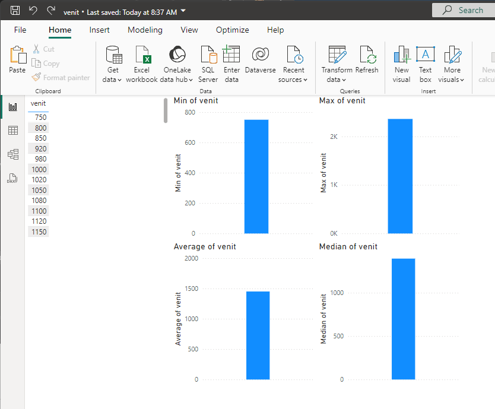

# Introducere în analiza statistică {#cap3}

## Concepte de bază privind analiza statistică

text

## Mărimile relative

text

## Sistematizarea datelor

text

## Indicatorii de nivel

### Aplicații

_1. Media unei serii simple_  

Se cunosc date privind veniturile salariale lunare (în lei/lună) ale celor 80 de angajați din firma M.  Caracteristicile serie sunt prezentate în tabelul următor și ne propunem realizarea acestei analize descriptive prin cele 4 platforme software.  

::: {.content-visible when-format="html"}
<style type="text/css">
.tg  {border-collapse:collapse;border-spacing:0;}
.tg td{border-color:black;border-style:solid;border-width:1px;font-family:Arial, sans-serif;font-size:14px;
  overflow:hidden;padding:10px 5px;word-break:normal;}
.tg th{border-color:black;border-style:solid;border-width:1px;font-family:Arial, sans-serif;font-size:14px;
  font-weight:normal;overflow:hidden;padding:10px 5px;word-break:normal;}
.tg .tg-c3ow{border-color:inherit;text-align:center;vertical-align:top}
.tg .tg-0pky{border-color:inherit;text-align:left;vertical-align:top}
</style>
<table class="tg"><thead>
  <tr>
    <th class="tg-c3ow"></th>
    <th class="tg-c3ow">grupe de venit<br>(lei)</th>
    <th class="tg-c3ow">$n_i$</th>
    <th class="tg-c3ow">$h_i$</th>
    <th class="tg-c3ow">$x_i$</th>
    <th class="tg-c3ow">$x_i n_i$</th>
    <th class="tg-c3ow">$N_i$\^</th>
  </tr></thead>
<tbody>
  <tr>
    <td class="tg-0pky"></td>
    <td class="tg-c3ow">0 – 1000</td>
    <td class="tg-c3ow">6</td>
    <td class="tg-c3ow">300</td>
    <td class="tg-c3ow">850</td>
    <td class="tg-c3ow">5100</td>
    <td class="tg-c3ow">6</td>
  </tr>
  <tr>
    <td class="tg-0pky">interval <br>quartila <br>inferioară</td>
    <td class="tg-c3ow">1001 – 1300</td>
    <td class="tg-c3ow">24</td>
    <td class="tg-c3ow">300</td>
    <td class="tg-c3ow">1150</td>
    <td class="tg-c3ow">27600</td>
    <td class="tg-c3ow">30</td>
  </tr>
  <tr>
    <td class="tg-0pky">interval <br>median</td>
    <td class="tg-c3ow">1301 – 1600</td>
    <td class="tg-c3ow">30</td>
    <td class="tg-c3ow">300</td>
    <td class="tg-c3ow">1450</td>
    <td class="tg-c3ow">43500</td>
    <td class="tg-c3ow">60</td>
  </tr>
  <tr>
    <td class="tg-0pky">interval <br>quartila <br>superioară</td>
    <td class="tg-c3ow">1601 – 1900</td>
    <td class="tg-c3ow">12</td>
    <td class="tg-c3ow">300</td>
    <td class="tg-c3ow">1750</td>
    <td class="tg-c3ow">21000</td>
    <td class="tg-c3ow">72</td>
  </tr>
  <tr>
    <td class="tg-0pky"></td>
    <td class="tg-c3ow">1901 – 2200</td>
    <td class="tg-c3ow">5</td>
    <td class="tg-c3ow">300</td>
    <td class="tg-c3ow">2050</td>
    <td class="tg-c3ow">10250</td>
    <td class="tg-c3ow">77</td>
  </tr>
  <tr>
    <td class="tg-0pky"></td>
    <td class="tg-c3ow">2201 – $\inf$</td>
    <td class="tg-c3ow">3</td>
    <td class="tg-c3ow">300</td>
    <td class="tg-c3ow">2350</td>
    <td class="tg-c3ow">7050</td>
    <td class="tg-c3ow">80</td>
  </tr>
  <tr>
    <td class="tg-0pky"></td>
    <td class="tg-c3ow">total</td>
    <td class="tg-c3ow">80</td>
    <td class="tg-c3ow">-</td>
    <td class="tg-c3ow">-</td>
    <td class="tg-c3ow">114500</td>
    <td class="tg-c3ow"></td>
  </tr>
</tbody></table>
:::

::: {.content-visible when-format="pdf"}
\begin{table}[!h]
\centering
\caption{Distribuția persoanelor, după venitul lunar}
\label{my-label}
\begin{tabular}{lcccccc}
\hline
\multicolumn{1}{c}{}                                                       & \begin{tabular}[c]{@{}c@{}}grupe de venit\\ (lei)\end{tabular} & $n_i$ & $h_i$ & $x_i$ & $x_i n_i$ & $N_i$\^{} \\ \hline
                                                                           & 0 – 1000                                                       & 6     & 300   & 850   & 5100      & 6         \\
\begin{tabular}[c]{@{}l@{}}interval \\ quartila \\ inferioară\end{tabular} & 1001 – 1300                                                    & 24    & 300   & 1150  & 27600     & 30        \\
\begin{tabular}[c]{@{}l@{}}interval \\ median\end{tabular}                 & 1301 – 1600                                                    & 30    & 300   & 1450  & 43500     & 60        \\
\begin{tabular}[c]{@{}l@{}}interval \\ quartila \\ superioară\end{tabular} & 1601 – 1900                                                    & 12    & 300   & 1750  & 21000     & 72        \\
                                                                           & 1901 – 2200                                                    & 5     & 300   & 2050  & 10250     & 77        \\
                                                                           & 2201 – $\inf$                                                  & 3     & 300   & 2350  & 7050      & 80        \\
                                                                           & total                                                          & 80    & -     & -     & 114500    &           \\ \hline
\end{tabular}
\end{table}
:::

Să se determine venitul salarial mediu lunar al angajaților firmei.  

#### Rezolvare prin R


::: {.cell}

```{.r .cell-code}
# incarcarea datelor "venit.csv"
venit <- read.csv("date/venit.csv", head = T)
# o vizualizare succinta a datelor
head(venit)
```

::: {.cell-output .cell-output-stdout}

```
  venit
1  1660
2  1410
3  1550
4  1820
5  1320
6  1340
```


:::

```{.r .cell-code}
# explorarea prelimiară a datelor
summary(venit)
```

::: {.cell-output .cell-output-stdout}

```
     venit     
 Min.   : 750  
 1st Qu.:1260  
 Median :1395  
 Mean   :1451  
 3rd Qu.:1605  
 Max.   :2360  
```


:::

```{.r .cell-code}
# intervalul datelor
range(venit$venit)
```

::: {.cell-output .cell-output-stdout}

```
[1]  750 2360
```


:::

```{.r .cell-code}
# calculul mediei seriei simple
mean(venit$venit)
```

::: {.cell-output .cell-output-stdout}

```
[1] 1450.875
```


:::
:::


Venitul salarial mediu lunar al celor 80 angajați ai firmei este de 1450.875 lei/lună.  


#### Rezolvare prin Python


::: {.cell}

```{.python .cell-code}
# importarea librariilor necesare
import pandas as pd

# incarcarea datelor "venit.csv"
venit = pd.read_csv("date/venit.csv")

# o vizualizare succinta a datelor
print(venit.head())
```

::: {.cell-output .cell-output-stdout}

```
   venit
0   1660
1   1410
2   1550
3   1820
4   1320
```


:::

```{.python .cell-code}
# explorarea preliminara a datelor
print(venit.describe())
```

::: {.cell-output .cell-output-stdout}

```
             venit
count    80.000000
mean   1450.875000
std     338.683952
min     750.000000
25%    1260.000000
50%    1395.000000
75%    1605.000000
max    2360.000000
```


:::

```{.python .cell-code}
# intervalul datelor
print(venit['venit'].min(), venit['venit'].max())
```

::: {.cell-output .cell-output-stdout}

```
750 2360
```


:::

```{.python .cell-code}
# calculul mediei seriei simple
print(venit['venit'].mean())
```

::: {.cell-output .cell-output-stdout}

```
1450.875
```


:::
:::


#### Rezolvare prin Excel


#### Rezolvare prin Power BI



## Indicatorii variației

• abateri, dispersie, abatere standard, repartiție, asimetrie, concentrare

## Vizualizarea datelor

text

